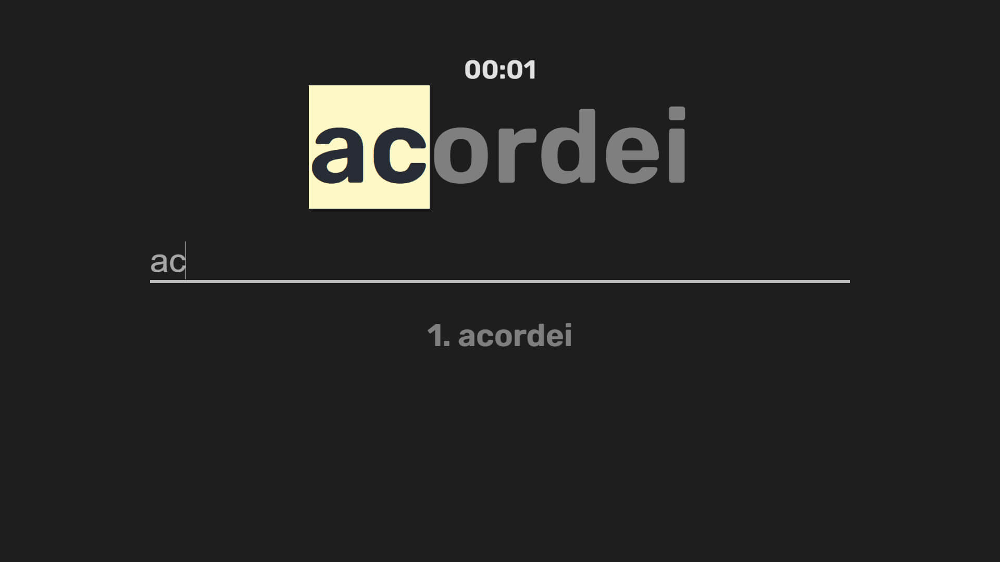
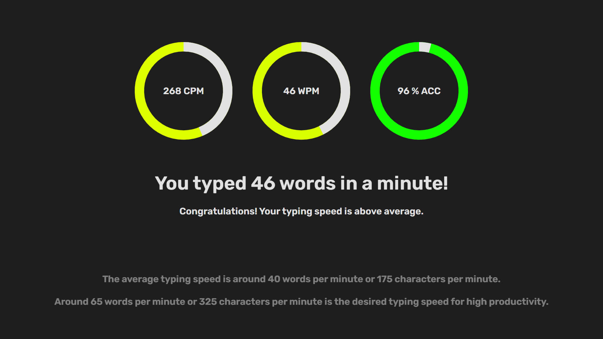

[![License: MIT][license-shield]][license-url]


[![React][react-shield]][react-url]
[![javascript][javascript-shield]][javascript-url]

[![LinkedIn][linkedin-shield]][linkedin-url]


<!-- PROJECT HEADER -->

  <p align="center">
    <br>
    A 60 seconds typing test to keep productivity in check!
    <br>
    <a href="https://totoledao.github.io/typingTest"><strong>Try it!</strong></a>
    <br>  
    <br>  
  </p>

<!-- TABLE OF CONTENTS -->
<details open="open">
  <summary><h2 style="display: inline-block">Table of Contents</h2></summary>
  <ol>
    <li>
      <a href="#about-the-project">About The Project</a>
      <ul>
        <li><a href="#built-with">Built With</a></li>
        <li><a href="#technologies">Technologies</a></li>
      </ul>
    </li>
    <li>
      <a href="#getting-started">Getting Started</a>
      <ul>
        <li><a href="#prerequisites">Prerequisites</a></li>
        <li><a href="#installation">Installation</a></li>
      </ul>
    </li>    
    <li><a href="#usage">Usage</a></li>
    <li><a href="#contributing">Contributing</a></li>
    <li><a href="#license">License</a></li>
    <li><a href="#contact">Contact</a></li>    
  </ol>
</details>


<!-- ABOUT THE PROJECT -->
## About The Project

<!-- ![typingTestAssets/Home.jpg) -->

**A quick test to asses your typing effectiveness!** <br>
You have 60 seconds to type as many words as possible and at the end a screen will show you your CPM (characters per minute), WPM (words per minute) and ACC (accuracy) and where your typing skill is at now.

Most words are in Brazilian Portuguese but don't let that frighten you, there are no words with accents (like é or ã).

The main goal of this project was:
- publish the website using GitHub Pages instead of Next.js
- have a go at animated components, like the numbers adding up to its current value and the interpolation of colors using RGB on the progress circle


### Built With

* [React][react-url]
* [JavaScript][javascript-url]

### Technologies
* GitHub Pages

<!-- GETTING STARTED -->
## Getting Started

To get a local copy up and running follow these simple steps.

### Prerequisites

* npm
  ```sh
  npm install npm@latest -g
  ```

### Installation

1. Clone the repo
   ```sh
   git clone https://github.com/totoledao/typingTest.git
   ```
2. Install dependencies
   ```sh
   npm install
   ```
3. Start the development server
   ```sh
   npm start
   ```

<!-- USAGE EXAMPLES -->
## Usage


Start typing and the timer will start. <br>
You will have 60 seconds to type as many words as possible.



At the end a short report will show your results and where they fall.

<!-- CONTRIBUTING -->
## Contributing

Contributions make the open source community such an amazing place to be, learn, inspire, and create. Any contributions you make are **greatly appreciated**.

1. Fork the Project
2. Create your Feature Branch (`git checkout -b feature/AmazingFeature`)
3. Commit your Changes (`git commit -m 'Add some AmazingFeature'`)
4. Push to the Branch (`git push origin feature/AmazingFeature`)
5. Open a Pull Request

<!-- LICENSE -->
## License

Distributed under the MIT License. See [`LICENSE`][license-url] for more information.


<!-- CONTACT -->
## Contact

Guilherme Toledo - guilherme-toledo@live.com

[](https://www.linkedin.com/in/guilhermemtoledo/)
[](https://www.facebook.com/totoledao)
[](https://www.instagram.com/totoledao)
[](https://www.github.com/totoledao)


Project Link: [https://github.com/totoledao/typingTest](https://github.com/totoledao/typingTest)

<!-- MARKDOWN LINKS & IMAGES -->
<!-- https://www.markdownguide.org/basic-syntax/#reference-style-links -->

[license-shield]: https://img.shields.io/badge/License-MIT-blue.svg
[license-url]: https://github.com/totoledao/typingTest/blob/main/MIT-LICENSE.txt
[linkedin-shield]: https://img.shields.io/badge/-LinkedIn-black.svg?style=for-the-badge&logo=linkedin&colorB=0e76a8
[linkedin-url]: http://www.linkedin.com/in/guilhermemtoledo

[react-shield]:https://img.shields.io/badge/React-20232A?style=for-the-badge&logo=react&logoColor=61DAFB

[react-url]: https://reactjs.org/

[javascript-shield]: https://img.shields.io/badge/javascript-%23323330.svg?style=for-the-badge&logo=javascript&logoColor=%23F7DF1E
[javascript-url]: https://www.javascript.com/
